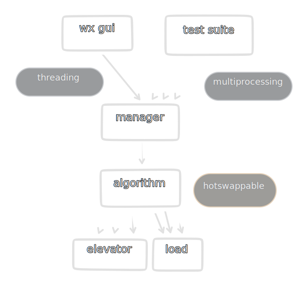
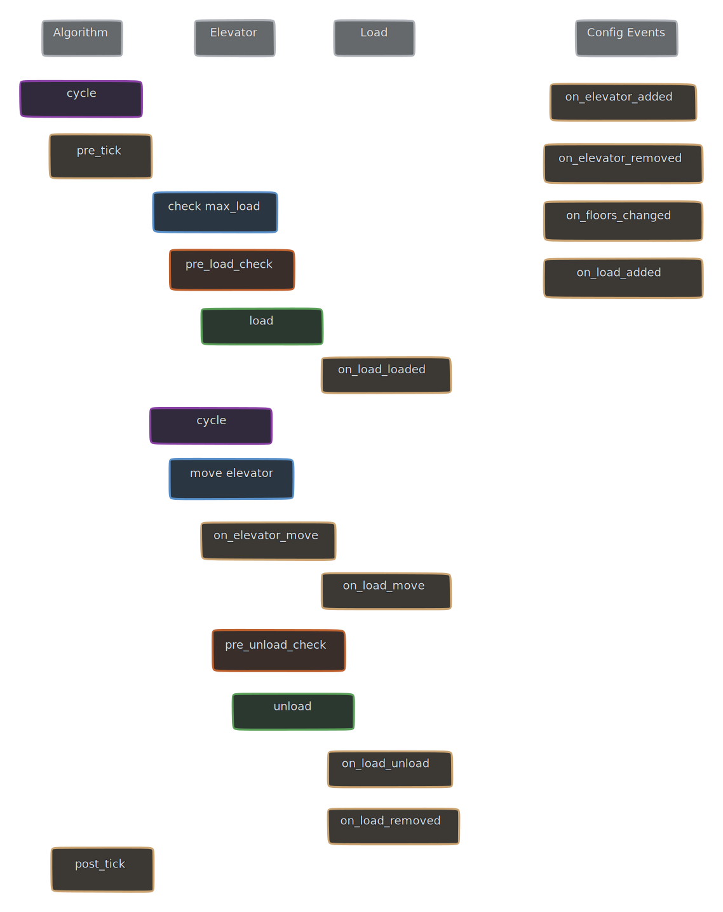
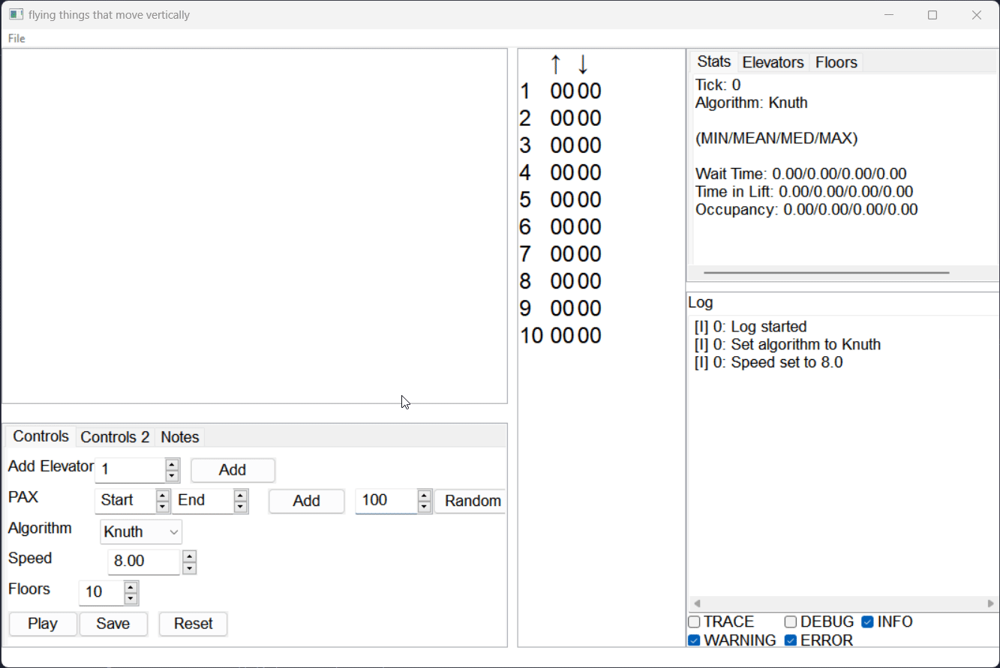

simulating elevators - [inspiration](https://youtu.be/xOayymoIl8U)


# Features
- Fully featured test suite to run automated tests
- Easy to use GUI to allow for manual testing and bug fixing
- Extensible framework to implement new algorithms and tests
- Ability to export and import artefacts for debugging or reproducible testing
- Adjustable simulation speed*

> *Simulation speed might not be as relative as one might expect. For example, the jump from 100 to 200 might not be double the speed as there might be other factors such as code computation affecting the slower execution.

## Development

Both the GUI and the Test Suite control the same managers and algorithms in the backend. However, there are wrappers to allow for the difference in concurrency type (threading/multiprocessing).



| File | Description |
| --- | --- |
| [app.py](/app.py) | GUI handler |
| [suite.py](/suite.py) | Test suite |
| [enums.py](/enums.py) | Various enums and constants |
| [models.py](/models.py) | Data models for custom classes |
| [utils.py](/utils.py) | Utility functions |
| [errors.py](/errors.py) | Custom errors |

### Dependencies
- wxPython===4.2.0 ([PyPi](https://pypi.org/project/wxPython/4.2.0/), [official website](https://wxpython.org/pages/downloads/index.html))

### Custom Algorithms

A custom algorithm can be made by subclassing [ElevatorAlgorithm](/models.py) in a file in the `algorithms` folder.

The name of the file is unimportant. 2 attributes need to be defined in the file, `__name__` (str) and `__algorithm__` (object) as shown.

When debugging, `algorithm.name` will be the `__name__` attribute.

```python
class MyAlgorithm(ElevatorAlgorithm):
    def __init__(self, *args, **kwargs):
        super().__init__(*args, **kwargs)
        # custom init code here

    def get_new_destination(self, elevator: Elevator) -> int:
        # return a integer for the new destination floor
        pass


__name__ = "My Custom Algorithm"
__algorithm__ = MyAlgorithm
```

There are various events exposed for subclasses but the only required function is `get_new_destination`. Exposed events are listed below.

```python
def pre_tick(self):
def post_tick(self):
def on_load_load(self, load, elevator):
def on_load_unload(self, load, elevator):
def on_elevator_move(self, elevator):
def on_elevator_added(self, elevator):
def on_elevator_removed(self, elevator):
def on_floors_changed(self):
def on_load_added(self, load):
def on_load_removed(self, load):
```

There are also 2 check functions that should return a boolean. If the check fails, the load will not be loaded/unloaded.
```python
def pre_load_check(self, load, elevator) -> bool:
def pre_unload_check(self, load, elevator) -> bool:
```

### The Cycle


Do note that for the GUI, GUI events will be triggered upon every configuration change and every tick. Refer to the [GUI](#gui) section and [ElevatorManager](/models.py) > `send_event` for more information.

## GUI

### End User

The script `app.py` exposes a [WXPython](https://www.wxpython.org/) GUI to allow end users to interact with the elevator simulator. 



### Development

The GUI uses a multithreaded approach as per the following explanation:
| Thread | Description |
| --- | --- |
| Main Thread | Manages the GUI and user input |
| Manager Thread | Manages the elevators and all backend related tasks |

Upon any changes in the manager thread, a [wx event](https://docs.wxpython.org/events_overview.html) is fired to allow for the main thread to update the GUI. This can happen *very very* often (multiple times per tick) hence it is important to keep the event handlers as lightweight as possible and perform as little layout changes.

## Test Suite


### End User

The test suite exposes a `TestSuite` class that takes in `TestSettings`. This allows the end user to create reproducible tests and feed them in programmatically. Refer to the source code for exact arguments.

Further options can also be fed into the `TestSuite` class. Refer to the source code for exact arguments.

Source Code: [suite.py](/suite.py)    
Examples: [test_json.py](/test_json.py) ([test.example.json](/test.example.json)), [test_benchmark.py](/test_benchmark.py)

### Development

The test suite runs using a multiprocess approach as per the following explanation:
| Process | Description |
| --- | --- |
| Main Process | Manages all processes and does final saving of results |
| Background Process | Handles errors raised by test processes and exports artefacts |
| `N` Test Processes | Runs the test and raises errors to the background process, reports back to main process |

The number of test processes (`N`) are determined by the following formula:
- <= the given `max_processes` kwarg
- <= (CPU Count - 1)
- <= Number of total iterations

The processes are then spawned and iterations are run concurrently. Upon any errors raised by the algorithm, it will be passed to the Background Process and the iteration will be skipped. A new process will be spawned to continue the test suite.

#### Benchmark Example

Rough example of what the test suite is capable of. This ran in under 3 minutes (10 iterations each) on a 4 physical core CPU.

```
BUSY                    TICK                 WAIT                 TIL              OCC
--------------------    -----------------    -----------------    -------------    -------------
C-LOOK                  317.60 (324.00)      97.38 (80.55)        27.97 (25.00)    56.92 (72.00)
C-SCAN                  304.40 (304.00)      93.91 (78.10)        27.03 (24.00)    57.23 (70.67)
Destination Dispatch    492.40 (486.50)      121.62 (103.25)      27.64 (25.00)    36.24 (20.67)
FCFS                    2609.80 (2631.50)    1073.34 (1008.65)    48.67 (42.40)    12.21 (0.00)
LOOK                    304.78 (302.00)      93.62 (77.28)        27.28 (25.00)    57.73 (71.85)
Rolling                 459.50 (456.50)      145.46 (144.55)      53.38 (50.75)    76.26 (93.33)
SCAN                    302.00 (301.50)      92.16 (73.80)        27.09 (24.00)    57.81 (72.67)
Scatter                 673.90 (676.00)      176.43 (166.00)      68.18 (47.60)    66.86 (91.33)

SLOW                    TICK                 WAIT                 TIL              OCC
--------------------    -----------------    -----------------    -------------    -------------
C-LOOK                  29.60 (32.00)        7.62 (7.45)          3.31 (3.00)      27.29 (24.33)
C-SCAN                  31.10 (31.50)        9.54 (8.60)          3.93 (4.00)      32.84 (28.33)
Destination Dispatch    36.50 (37.00)        10.12 (8.95)         4.83 (4.35)      36.35 (33.33)
FCFS                    108.10 (108.00)      45.65 (43.90)        6.22 (5.00)      16.26 (12.67)
LOOK                    30.70 (32.00)        8.68 (8.05)          3.97 (4.00)      33.73 (30.33)
Rolling                 36.80 (37.00)        10.18 (8.85)         6.42 (5.80)      50.51 (54.67)
SCAN                    32.11 (31.00)        9.04 (8.78)          4.14 (4.00)      34.39 (30.00)
Scatter                 43.40 (42.50)        10.61 (9.10)         6.95 (5.70)      47.06 (51.00)

```