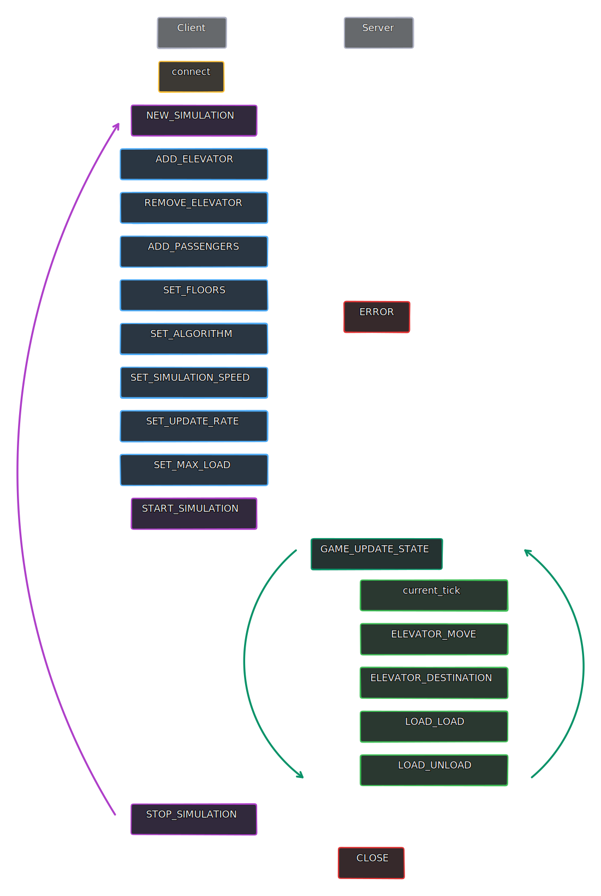
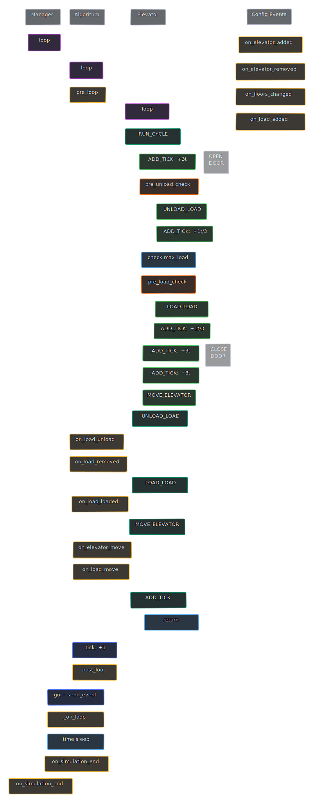

simulating elevators - [inspiration](https://youtu.be/xOayymoIl8U)

# Contents
- [Features](#features)
- [Python GUI](#python-gui)
    - [End User](#end-user)
    - [Development](#development)
- [Web GUI](#web-gui)
    - [End User](#end-user-1)
    - [Development](#development-1)
- [Test Suite](#test-suite)
    - [End User](#end-user-1)
    - [Development](#development-1)
        - [Benchmark Example](#benchmark-example)

## Features
- Fully featured test suite to run automated tests
- Easy to use GUI to allow for manual testing and bug fixing
- Extensible framework to implement new algorithms and tests
- Ability to export and import artefacts for debugging or reproducible testing
- Adjustable simulation speed*

> *Simulation speed might not be as relative as one might expect. For example, the jump from 100 to 200 might not be double the speed as there might be other factors such as code computation affecting the slower execution.

## Python GUI

### End User

The `gui` module exposes a [WXPython](https://www.wxpython.org/) GUI to allow end users to interact with the elevator simulator.

Run `python -m gui`


### Development

The GUI uses a multithreaded approach as per the following explanation:
| Thread | Description |
| --- | --- |
| Main Thread | Manages the GUI and user input |
| Manager Thread | Manages the elevators and all backend related tasks |

Upon any changes in the manager thread, a [wx event](https://docs.wxpython.org/events_overview.html) is fired to allow for the main thread to update the GUI. This can happen *very very* often (multiple times per tick) hence it is important to keep the event handlers as lightweight as possible and perform as little layout changes.


## Web GUI

### End User

The [`web/frontend`](/web/frontend) folder contains a web interface to interact with the elevator simulator. The web interface is built using [next.js](https://nextjs.org/) and [Material-UI](https://material-ui.com/).

To run the frontend, run `yarn build` > `yarn start` in the `web/frontend` folder.

The `web.backend` module exposes an asynchronous websocket server to allow for communication between the web interface and the elevator simulator.

To run the backend, run `python -m web.backend`.

### Development

The web interface and backend communicate through websockets with packets. The web frontend essentially takes data from the websocket and simply presents it. The backend is responsible for managing the elevators and algorithms.

Each manager pool has a min and max manager count. This can be adjusted based on computer hardware as spinning up more manager will allow more users to connect concurrently but will also consume more resources.
- min_manager: The initial number of managers to start and keep active
- max_manager: The maximum number of managers to allow to be active concurrently. This should be kept higher in case of sudden load.

A rough outline of the packet structure is as follows:
```
4 bytes: header
2 bytes: opcode
2 bytes: length (n)
[
    n bytes: data --> integer (2 bytes short endian), string (ascii)
]
2 bytes: checksum (length, data)
4 bytes: tail
```

A basic simulation is done by sending the below packets. After each client packet, the server will respond with the same packet (possibly with additional data).


The next.js frontend can be run with `yarn dev` in the [`web/frontend`](/web/frontend) folder.

## Test Suite

### End User

The test suite exposes a `TestSuite` class that takes in `TestSettings`. This allows the end user to create reproducible tests and feed them in programmatically. Refer to the source code for exact arguments.

Further options can also be fed into the `TestSuite` class. Refer to the source code for exact arguments.

It is recommended for the `name` to not be distinguishable to the algorithm and multiple tests (with different algorithms) to have identical names.

`python -m tests` will run all the tests in the `tests` folder. Tests must contain a  `run_test` function

Source Code: [suite.py](/suite.py)    
Examples: [test_json.py](/test_json.py) ([test.example.json](/test.example.json)), [test_benchmark.py](/test_benchmark.py)

### Development

The test suite runs using a multiprocess approach as per the following explanation:
| Process | Description |
| --- | --- |
| Main Process | Manages all processes and does final saving of results |
| Background Process | Handles errors raised by test processes and exports artefacts |
| `N` Test Processes | Runs the test and raises errors to the background process, reports back to main process |

The number of test processes (`N`) are determined by the following formula:
- <= the given `max_processes` kwarg
- <= (CPU Count - 1)
- <= Number of total iterations

The processes are then spawned and iterations are run concurrently. Upon any errors raised by the algorithm, it will be passed to the Background Process and the iteration will be skipped. A new process will be spawned to continue the test suite.

Tests are *mostly replicable* with the given seed. The initial state should be the same but there might be small kinks that could result in slightly varied outcomes. Note that for each seed, the iteration count is also attached to it.

#### Benchmark Example

Rough example of what the test suite is capable of. This ran in under 3 minutes (10 iterations each) on a 4 physical core CPU.

```
SLOW                  NUM  TICK                 WAIT               TIL              OCC
--------------------  ---  -------------------  -----------------  ---------------  -------------
Rolling               10   714.90 (697.00)      295.20 (285.35)    44.19 (38.95)    58.40 (67.33)
Destination Dispatch  10   889.00 (913.50)      353.88 (334.30)    55.40 (50.35)    57.22 (62.00)
Scatter               10   955.10 (956.50)      387.54 (384.25)    74.25 (59.65)    75.16 (84.00)
LOOK                  10   1267.40 (1311.50)    519.34 (504.15)    102.95 (88.60)   78.52 (88.67)
NStepLOOK             10   1343.70 (1400.50)    525.12 (478.45)    68.43 (58.35)    49.47 (51.33)
FCFS                  10   1552.20 (1569.50)    680.54 (670.45)    75.26 (69.75)    46.25 (46.00)

BUSY                  NUM  TICK                 WAIT               TIL              OCC
--------------------  ---  -------------------  -----------------  ---------------  -------------
Rolling               10   5161.20 (5125.00)    2197.29 (2105.40)  183.15 (155.40)  68.51 (92.00)
Destination Dispatch  10   5364.70 (5459.00)    2159.20 (2063.25)  172.26 (159.20)  60.34 (68.00)
Scatter               10   8144.80 (8166.50)    3453.09 (3427.00)  354.35 (242.15)  85.22 (98.67)
LOOK                  10   8264.10 (8197.00)    3609.78 (3591.35)  367.68 (306.55)  88.06 (98.67)
NStepLOOK             10   12005.00 (12145.50)  4507.09 (4395.95)  183.98 (157.45)  29.77 (14.67)
FCFS                  10   13627.00 (13976.50)  5957.50 (5818.15)  243.40 (213.35)  34.09 (24.67)
```

## Development

Both the GUIs and the Test Suite control the same managers and algorithms in the backend. However, there are wrappers to allow for the difference in concurrency type (threading/multiprocessing/asyncio).


| File | Description |
| --- | --- |
| [gui.py](/gui.py) | GUI handler |
| [gui](/gui) | GUI backend |
| [web](/web) | Web interface |
| [suite](/suite) | Test suite |
| [models](/models) | Data models for custom classes |
| [constants.py](/constants.py) | Various enums and constants |
| [utils.py](/utils.py) | Utility functions |
| [errors.py](/errors.py) | Custom errors |

### Dependencies
- wxPython===4.2.1 ([PyPi](https://pypi.org/project/wxPython/4.2.1/), [official website](https://wxpython.org/pages/downloads/index.html))
- tqdm===4.65.0 [test suite only] ([PyPi](https://pypi.org/project/tqdm/4.65.0/))
- colorama===0.4.6 [test suite only] ([PyPi](https://pypi.org/project/colorama/0.4.6/))

### Custom Algorithms

A custom algorithm can be made by subclassing [ElevatorAlgorithm](/models.py) in a file in the `algorithms` folder.

The name of the file is unimportant. 2 attributes need to be defined in the file,  `__algorithm__` (object) as shown. `name` must be defined in the subclass.

```python
class MyAlgorithm(ElevatorAlgorithm):
    name = "My Custom Algorithm"

    def __init__(self, *args, **kwargs):
        super().__init__(*args, **kwargs)
        # custom init code here

    def get_new_destination(self, elevator: Elevator) -> int:
        # return a integer for the new destination floor
        pass


__algorithm__ = MyAlgorithm
```

There are various events exposed for subclasses but the only required function is `get_new_destination`. Exposed events are listed below.

```python
def pre_loop(self):
def post_loop(self):
def on_load_load(self, load, elevator):
def on_load_unload(self, load, elevator):
def on_elevator_move(self, elevator):
def on_elevator_added(self, elevator):
def on_elevator_removed(self, elevator):
def on_floors_changed(self):
def on_load_added(self, load):
def on_load_removed(self, load):
def on_simulation_end(self, load):
```

There are also 2 check functions that should return a boolean. If the check fails, the load will not be loaded/unloaded.
```python
def pre_load_check(self, load, elevator) -> bool:
def pre_unload_check(self, load, elevator) -> bool:
```

### The Loop

The loop is managed by the [ActionQueue](/models/action.py) which prioritises the actions to be carried out on an elevator. The loop is called once every tick and actions are executed until `ADD_TICK`.

If there are no actions to be carried out, the elevator will carry out `RUN_CYCLE`.

| Action | Description |
| --- | --- |
| ADD_TICK | Adds a tick to the elevator |
| RUN_CYCLE | Runs the elevator [cycle](#the-cycle) |
| MOVE_ELEVATOR | Moves the elevator to the next floor |
| LOAD_LOAD | Loads the load into the elevator |
| UNLOAD_LOAD | Unloads the load from the elevator |


Ticks are only physically added in the algorithm, after the entire elevator's cycle executes and it exits with a `ADD_TICK` action. This repeats again in the next tick.

For example, a typical action call could be as follows:
```python
RUN_CYCLE
ADD_TICK - 3  # moving elevator
MOVE_ELEVATOR

RUN_CYCLE
ADD_TICK - 3  # door open
LOAD_LOAD
LOAD_LOAD
LOAD_LOAD
ADD_TICK - 1  # 3 loads
LOAD_LOAD
LOAD_LOAD
LOAD_UNLOAD
ADD_TICK - 1  # 3 loads
LOAD_UNLOAD
ADD_TICK - 1  # 3 loads (part thereof)
ADD_TICK - 3   # door close
ADD_TICK - 3  # moving elevator
MOVE_ELEVATOR
```



> GUI events will be triggered upon every configuration change and every tick. Refer to [GUI](#gui) and [ElevatorManager](/models.py) > `send_event` for more information.

#### Ticks
A tick is represented by 1 second (assuming 1x speed). The following are rough guidelines of how many ticks each action should take

| Action | Ticks | Remarks
| --- | --- | --- |
| MOVE_ELEVATOR | 3 | |
| LOAD_LOAD/UNLOAD_LOAD | 1 per 3 loads (or part thereof) | The counter is combined for both loading and unloading loads. |
| OPEN_DOOR | 3 | This is only called when there is at least 1 load to load/unload. |
| CLOSE_DOOR | 3 | This is only called when there is at least 1 load to load/unload. |


#### The Cycle
The cycle is the main event loop of the elevator. It can be broken down into 3 major parts:
1. Remove existing loads
2. Add new loads
3. Move the elevator
